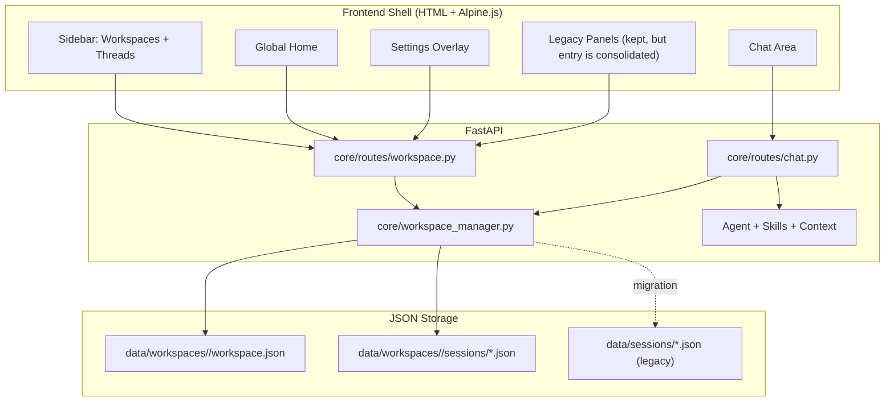

# Design Document: codex-style-workspace-ui

## 概述

本次设计的核心目标，是把 OpenGuiclaw 的主交互收敛成“Codex 风格的多工作区工作台”，同时避免一次高风险的前端全量重写。

这份设计明确采用以下方案：

- 后端继续使用 FastAPI
- 页面入口继续使用 Jinja2
- 前端继续使用 HTML / CSS / Alpine.js / 原生 JavaScript
- 本次 **不切换到 React**
- 本次聚焦于“主壳重构”，而不是“所有面板全部重写”

换句话说，这一版的目标不是“现代化前端框架升级”，而是“在当前 pywebui / FastAPI 架构内，做一次合理的产品与信息架构重组”。

---

## 为什么本次不切 React

### 当前项目现状

从当前仓库结构看，前端已经具备明显的应用壳特征：

- `templates/index.html` 是应用入口
- `templates/panels/*.html` 承载多个现有面板
- `static/js/app-logic.js` 负责主要状态与交互逻辑
- FastAPI 直接提供模板、静态资源和 `/api/*` 接口

这说明当前前后端耦合方式已经形成了一套稳定路径：

`FastAPI API + Jinja2 entry + Alpine.js state + static assets`

### 为什么不建议现在全量迁移 React

如果现在直接切 React，会同时引入以下变化：

- 新的构建链
- 新的前端目录结构
- 新的状态管理方式
- 新的打包与发布流程
- 模板与现有面板的大规模迁移

这会把“Workspace 架构重构”和“前端技术栈迁移”绑成同一个项目，风险过高。

### 为什么现阶段继续 Alpine 更合适

本次的主要问题本质上是：

- 工作区与线程信息架构需要收敛
- 前端主壳需要重排
- 当前状态与路由关系需要重新定义
- 多项目管理体验要更像 Codex

这些问题都可以在当前技术栈内解决，不必依赖 React 才能成立。

### React 的定位

React 不是被否定，而是被明确降级为 **未来可选演进方向**：

- 如果后续 Frontend Shell 稳定后，`app-logic.js` 继续膨胀
- 如果 Sidebar / Chat / Settings / Home 的状态耦合继续变复杂
- 如果需要组件化复用和更强的前端测试能力

再单独立项做“Frontend Shell React 化”，会更稳。

因此，本次方案结论是：

> 当前版本采用“渐进式 Shell 重构”，不做全量 React 重写。

---

## 目标架构



---

## 本次确定的产品结构

### 1. Global Home

Global Home 是应用级首页，不绑定某个真实项目目录。

它负责：

- 展示最近工作区
- 展示最近线程
- 提供创建工作区入口
- 提供打开设置入口

它不负责：

- 承载项目聊天历史
- 作为真实工作区参与聊天
- 参与服务端路由判断

### 2. Sidebar

Sidebar 是本次改造的第一优先级。

结构固定为三块：

1. 顶部：Global Home 入口 + 新建工作区
2. 中部：Workspace List + 当前工作区 Thread List
3. 底部：新建对话 + 设置入口

Sidebar 只负责导航，不再承担复杂设置面板承载职责。

### 3. Chat Area

主区只承载两类主体验：

- 当前工作区聊天视图
- 无活跃线程时的欢迎态

它保留现有能力：

- SSE 流式聊天
- 文件上传
- slash commands
- 消息渲染
- 中断任务

### 4. Settings Overlay

Settings 改成统一入口，不再通过多个散落面板直接暴露。

建议分组：

- General
- Appearance
- Models & Persona
- Integrations
- Diagnostics
- Archived

现有复杂配置内容可以先保留原始实现，只要求入口收敛、视觉结构简化。

---

## 非目标

本次明确不做以下事情：

1. 不全量改造成 React SPA
2. 不重写所有旧面板内部逻辑
3. 不一次性改掉所有历史 API
4. 不把所有页面都做成全新视觉系统
5. 不把 VRM、memory、scheduler 等复杂模块一起全面重构

这次只做：

- 数据边界收正
- Frontend Shell 重构
- Workspace / Thread 工作流打通
- 设置入口收敛

---

## 数据模型

### workspace.json

```json
{
  "id": "ws_abc123",
  "name": "My Project",
  "workspace_path": "D:\\myproject",
  "created_at": "2026-03-17T12:00:00Z",
  "updated_at": "2026-03-17T12:00:00Z",
  "persona_file": null,
  "model_overrides": null,
  "archived": false
}
```

### Session JSON

沿用当前 Session 基本结构，仅增加 `archived`：

```json
{
  "session_id": "sess_xyz",
  "created_at": "2026-03-17T12:00:00Z",
  "updated_at": "2026-03-17T12:30:00Z",
  "archived": false,
  "messages": []
}
```

---

## 后端方案

### WorkspaceManager

职责保持不变，但需要明确成为 Workspace 真正的单一事实源：

- 工作区 CRUD
- 工作区路径规范化与去重
- 线程归档、恢复、删除
- 文件树读取
- 旧会话迁移

### Workspace API

保留当前显式工作区寻址方式：

- `GET /api/workspaces`
- `GET /api/workspaces/archived`
- `POST /api/workspaces`
- `PATCH /api/workspaces/{workspace_id}`
- `DELETE /api/workspaces/{workspace_id}`
- `POST /api/workspaces/{workspace_id}/unarchive`
- `GET /api/workspaces/{workspace_id}/sessions`
- `POST /api/workspaces/{workspace_id}/sessions/{session_id}/archive`
- `POST /api/workspaces/{workspace_id}/sessions/{session_id}/unarchive`
- `DELETE /api/workspaces/{workspace_id}/sessions/{session_id}`
- `GET /api/workspaces/{workspace_id}/files`
- `GET /api/home`

### Chat API

本次设计要求工作区聊天继续使用显式工作区路由：

- `POST /api/workspaces/{workspace_id}/sessions/new`
- `GET /api/workspaces/{workspace_id}/sessions/{session_id}/messages`
- `POST /api/workspaces/{workspace_id}/sessions/{session_id}/stream`
- `POST /api/workspaces/{workspace_id}/sessions/{session_id}/abort`

兼容性接口如 `/load` 可以短期保留，但不应成为新前端主路径。

### 关键正确性要求

后端需要保证：

1. 不依赖全局 active workspace
2. 不修改全局 `agent.sessions._current` 参与 workspace stream 主流程
3. 不向全局 `data/sessions/` 双写
4. 避免同一 `workspace_id/session_id` 并发写回时发生静默覆盖

---

## 前端方案

## 主壳布局

```text
┌──────────────────────────────┬─────────────────────────────────────────┐
│ Sidebar                      │ Main Panel                              │
│                              │                                         │
│ Global Home                  │ Home / Chat                             │
│ New Workspace                │ Top Bar                                 │
│ Workspace List               │ Message List / Welcome State            │
│ Current Workspace Threads    │ Composer                                │
│ New Thread                   │                                         │
│ Settings                     │ Settings Overlay                        │
└──────────────────────────────┴─────────────────────────────────────────┘
```

### 前端状态建议

`mainApp()` 应新增并统一以下状态：

```javascript
workspaces: [],
archivedWorkspaces: [],
homeData: null,
activeWorkspaceId: null,
activeWorkspace: null,
workspaceThreads: [],
currentThreadId: null,
currentView: "home", // "home" | "chat"
showSettings: false,
settingsTab: "general",
workspaceLoading: false,
threadLoading: false,
isSwitchingWorkspace: false,
isAbortingBeforeSwitch: false,
```

### 前端关键方法

```javascript
async loadHome()
async loadWorkspaces()
async switchWorkspace(workspaceId)
async loadWorkspaceThreads(workspaceId)
async createWorkspace(name, path)
async renameWorkspace(workspaceId, name)
async archiveWorkspace(workspaceId)

async createThread(workspaceId)
async loadThread(workspaceId, sessionId)
async archiveThread(workspaceId, sessionId)
async deleteArchivedThread(workspaceId, sessionId)
async sendWorkspaceMessage(workspaceId, sessionId, message)
async abortWorkspaceStream(workspaceId, sessionId)
```

### 迁移策略

为了降低风险，前端按两层推进：

#### Phase 1：Shell 重构

先做：

- Sidebar
- Global Home
- Workspace 切换
- Thread List
- Chat 主区与欢迎态
- Settings Overlay 入口收敛

先不做：

- 全量重写旧配置面板内部细节
- React 化

#### Phase 2：旧面板收敛

后续逐步把现有 panel 接入统一 Settings 或独立分组，但不阻塞 Phase 1。

---

## 与 React 的未来兼容

为了不给未来 React 化设置障碍，本次前端重构要遵守两条规则：

1. 前端状态命名与 API 协议尽量稳定
2. 主壳与业务 API 之间只通过 `/api/*` 和 SSE 通信，不把模板逻辑和后端行为强耦合

这样如果未来要上 React，可以只替换 Frontend Shell，而不必先推翻 Workspace API。

---

## 迁移与兼容

### 后端迁移

迁移逻辑沿用当前方案：

- 首次检测到旧 `data/sessions/`
- 若未迁移且不存在有效 workspace
- 则创建默认工作区并复制旧 session
- 保留原始 `data/sessions/`

### 前端兼容

现有老接口可以短期保留，但新主壳必须优先走 Workspace API。

也就是说：

- 旧 `api/sessions/*` 可暂时保留给旧 UI
- 新 Workspace Shell 不再依赖旧全局 session API

---

## 成功标准

这次方案是否成功，不看是否用了 React，而看下面这些是否成立：

1. 用户能在一个全局 OpenClaw 中管理多个项目工作区
2. 工作区和线程的边界对用户来说足够清晰
3. 主界面比现在明显更简洁、更接近 Codex
4. 切换工作区和线程不会串上下文
5. 设置入口明显收敛
6. 前端没有因为框架迁移而整体返工

---

## 文件变更范围

### 必改

- `core/workspace_manager.py`
- `core/routes/workspace.py`
- `core/routes/chat.py`
- `core/server.py`
- `templates/index.html`
- `static/js/app-logic.js`

### 可延后

- `templates/panels/*.html`
- 次要配置页与附属面板的内部重构
- 未来的 React 版本主壳
