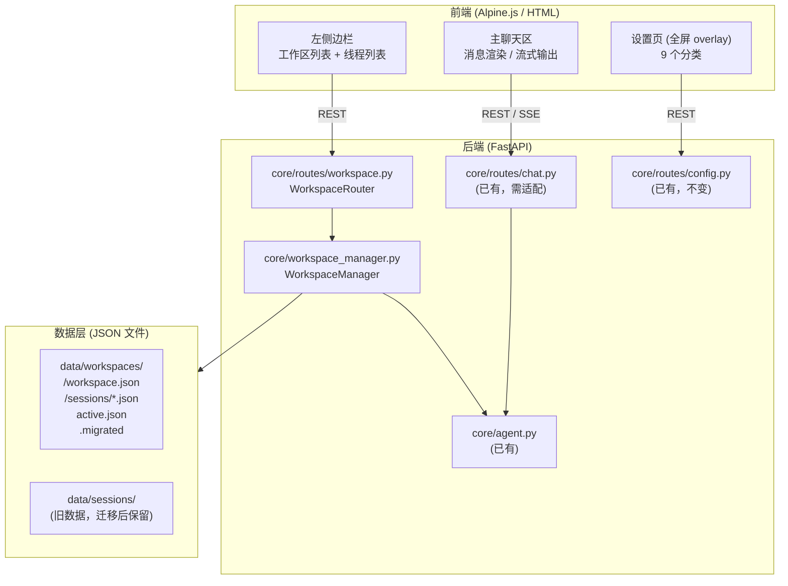

# Design Document: codex-style-workspace-ui

## 概述

为 openGuiclaw 添加类 Codex 的多工作区（Workspace）功能，并对前端进行大幅重构。
每个工作区绑定一个用户指定的文件夹路径（`workspace_path`），拥有独立的聊天历史（Sessions）、可选人设和模型配置。
前端重构为三栏布局：240px 固定左侧边栏（工作区列表 + 聊天线程列表）+ 主聊天区 + 可选右侧面板；
左下角齿轮按钮打开全屏设置页，替代现有分散的面板入口。

---

## 1. 架构概览

