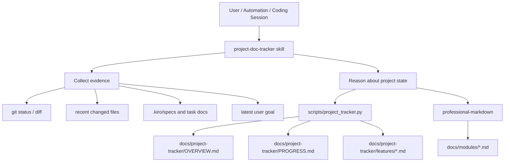

# 设计文档：project-doc-tracker

## 概述

`project-doc-tracker` 被设计为一个**项目长期记忆与文档调度 skill**，而不是单独的底层库。它的职责是让 AI 在项目推进过程中形成可追溯、可恢复、低幻觉的记录体系，并在功能成熟后把正式长文档交给 `professional-markdown` 生成。

整体结构分为四层：

1. **SKILL.md**
   - 定义触发条件
   - 规定证据采集顺序
   - 规定如何判断事项状态
   - 规定何时更新概览、何时追加日志、何时维护轻量说明卡片
   - 规定何时提升为正式文档
2. **scripts/project_tracker.py**
   - 创建跟踪目录和默认模板
   - 通过标记块稳定更新 `OVERVIEW.md`
   - 按 `feature_id` 合并更新事项表，而不是整表覆盖
   - 追加 `PROGRESS.md`
   - 维护轻量功能卡片
3. **项目跟踪文档**
   - `docs/project-tracker/OVERVIEW.md`
   - `docs/project-tracker/PROGRESS.md`
   - `docs/project-tracker/features/*.md`
4. **正式文档协作层**
   - `professional-markdown`
   - `docs/modules/*.md` 或用户指定的正式文档目录

---

## 架构



---

## Skill 工作流

### 模式 1：初始化跟踪文档体系

适用场景：

- 项目第一次接入该 skill
- 项目内还没有 `docs/project-tracker/`
- 现有项目已经有代码，但还没有长期进展跟踪文档

说明：

- 这里的“初始化”仅指初始化 tracker 文档体系
- 不包括安装依赖、数据库初始化、服务启动或测试 bootstrap
- 如果仓库里已经有实质代码，初始化后应补全初始内容，而不是只留下空模板

步骤：

1. 确认目标项目根目录
2. 调用脚本初始化跟踪目录
3. 检查 `OVERVIEW.md`、`PROGRESS.md`、`features/` 是否就位
4. 若仓库已有代码和 spec，则扫描主要模块、最近改动和 `.kiro/specs/`
5. 回填初始 `OVERVIEW.md`
6. 为主要模块创建或更新基础 feature notes
7. 标出适合后续 `promote-to-doc` 的正式文档候选
8. 在回复中说明后续如何继续追加进展

### 模式 2：记录一次开发会话

适用场景：

- 用户刚完成一段实现或修改
- 需要把一次会话的结果沉淀下来

步骤：

1. 收集证据：优先看 `git status` / diff、最近改动文件、关联 spec/task
2. 归纳这次会话主要推进了什么
3. 判断变更类型、影响范围、下一步和阻塞项
4. 调用脚本追加 `PROGRESS.md`
5. 调用脚本同步 `OVERVIEW.md`
   - 对已有 `feature_id` 做合并更新
   - 对新功能追加新行
   - 将“下一步建议”“已知阻塞”维护为按功能分项的 bullet 列表

### 模式 3：恢复项目上下文

适用场景：

- 项目隔了一段时间未跟进
- 用户说“帮我看看现在做到哪了”

步骤：

1. 读取 `OVERVIEW.md`
2. 读取最近若干条 `PROGRESS.md`
3. 必要时补看最近变更文件或 spec
4. 输出当前状态、下一步和待确认点

### 模式 4：维护轻量功能卡片

适用场景：

- 某个功能阶段完成
- 需要保留实现背景与后续维护信息
- 还不适合直接写成长文档

步骤：

1. 确认功能 ID 和标题
2. 汇总背景、实现摘要、关键文件、遗留问题
3. 调用脚本更新或创建对应轻量说明卡片
4. 同步刷新 `OVERVIEW.md` 中该事项状态

### 模式 5：提升为正式文档

适用场景：

- 某个功能已经 `done` 或 `stable`
- 需要生成类似 `docs/modules/` 风格的正式模块文档
- 需要基于现有代码批量补多个成熟模块的文档

步骤：

1. 识别成熟功能或模块
2. 读取 tracker note、最近 progress、相关 spec 和源码
3. 调用 `professional-markdown` 输出正式文档
4. 回写 tracker note 和 `OVERVIEW.md`，补充正式文档链接

---

## Skill 目录设计

```text
project-doc-tracker/
├─ SKILL.md
├─ agents/
│  └─ openai.yaml
├─ scripts/
│  └─ project_tracker.py
└─ references/
   ├─ workflow.md
   └─ tracker-format.md
```

### 为什么保留 scripts/

因为这个 skill 里有一类操作非常适合确定性落地：

- 初始化目录和模板
- 按标记块更新 `OVERVIEW.md`
- 追加结构化日志
- 维护轻量功能卡片

这些操作如果每次都由 AI 直接手写，长期会出现格式漂移；放到 `scripts/` 里更稳。

长文档不在 `scripts/` 内生成，因为：

- 正式模块文档篇幅长、结构复杂
- 更适合由 `professional-markdown` 按高质量 Markdown 规范直接生成
- 避免在 `project-doc-tracker` 中重复维护一套长文档模板系统

---

## 数据模型

### 目录结构

```text
docs/project-tracker/
├─ OVERVIEW.md
├─ PROGRESS.md
└─ features/
   ├─ auth-login.md
   └─ project-doc-tracker.md
```

### OVERVIEW.md

采用显式标记块，避免依赖 Markdown 标题正则。

```markdown
# Project Tracker

## 项目简介
<!-- project-tracker:intro:start -->
待补充。
<!-- project-tracker:intro:end -->

## 当前活跃事项
<!-- project-tracker:items:start -->
| feature_id | 标题 | 状态 | 最近更新 | 下一步 | 关键文件 | 正式文档 |
| --- | --- | --- | --- | --- | --- | --- |
<!-- project-tracker:items:end -->

## 最近一次会话
<!-- project-tracker:session:start -->
待补充。
<!-- project-tracker:session:end -->

## 下一步建议
<!-- project-tracker:next:start -->
- core-agent: 补充回归测试
- memory-system: 优化向量检索
<!-- project-tracker:next:end -->

## 已知阻塞
<!-- project-tracker:blockers:start -->
- memory-system: 向量存储仍在内存中
<!-- project-tracker:blockers:end -->
```

说明：

- `sync-item` 必须按 `feature_id` 合并事项表中的对应行
- 不允许每次只保留最后一条事项
- “下一步建议”和“已知阻塞”应优先使用 `- feature-id: 内容` 的 keyed bullet 形式

### PROGRESS.md

采用追加式记录，每条日志为一个独立块：

```markdown
# Project Progress Log

## 2026-03-13T11:20:00+08:00
- change_type: feature
- feature_id: project-doc-tracker
- summary: 将项目规格从通用 Python 库重构为 skill 结构
- files: .kiro/specs/project-doc-tracker/requirements.md, .agents/skills/project-doc-tracker/SKILL.md
- next_step: 补齐 helper script 和 reference 文档
- blockers: 无
- confidence: high
```

### Feature Note

每个功能使用稳定文件名，例如 `project-doc-tracker.md`：

```markdown
# Feature Note: project-doc-tracker

- feature_id: project-doc-tracker
- title: 项目文档跟踪 skill
- updated_at: 2026-03-13T11:30:00+08:00
- status: in_progress

## 背景

...

## 当前实现摘要

...

## 关键文件

- path/to/file

## 风险与已知问题

...

## 后续建议

...

## 正式文档

- docs/modules/project-doc-tracker.md
```

Feature Note 的定位是轻量卡片，不替代正式文档。

### Formal Doc

成熟功能的正式文档默认写入 `docs/modules/`，并由 `professional-markdown` 负责生成，例如：

```text
docs/modules/
├─ memory.md
├─ scheduler.md
└─ skills.md
```

---

## 脚本接口设计

脚本文件：`scripts/project_tracker.py`

### CLI 子命令

1. `init`
   - 初始化 `docs/project-tracker/`
2. `log`
   - 追加一条会话日志
3. `sync-item`
   - 更新 `OVERVIEW.md` 的活跃事项表
4. `feature-note`
   - 更新或创建某个功能的轻量说明卡片
5. `status`
   - 输出当前概览和最近若干条日志

不新增 `promote-to-doc` 对应的 Python 子命令。它是 skill 工作流能力，不是脚本能力。

### 设计原则

- AI 负责推理，脚本负责写入
- 脚本只接收已经整理好的字段，不负责猜测项目状态
- 脚本默认采用 UTF-8
- 脚本使用标准库实现
- 长文档由 `professional-markdown` 直接生成

---

## 关键决策

### 决策 1：不再自动注入 AI 规则文件

原因：

- 侵入性强
- 容易和已有 `AGENTS.md`/`CLAUDE.md` 冲突
- 对 skill 而言不是必要条件

结论：

- 默认不做自动注入
- 若未来需要，可作为单独的可选命令

### 决策 2：日志采用只追加模型

原因：

- 更适合长期审计和恢复上下文
- 避免“后来删改导致历史不可信”

结论：

- 不提供硬删除历史日志作为默认能力
- 纠错通过新增“更正记录”完成

### 决策 3：用标记块代替标题正则

原因：

- 标题可能被用户改名
- 相同层级标题可能重复
- 标记块更适合稳定更新局部内容

### 决策 4：正式文档不在 tracker skill 内硬编码生成

原因：

- 已经有 `professional-markdown` 可复用
- 重复造长文档生成能力会导致职责重叠
- 长文档结构与审美更适合交给专门文档 skill

### 决策 5：`sync-item` 必须支持多事项长期维护

原因：

- 真实项目会同时推进多个功能
- 单次整表覆盖会让 tracker 很快失真
- 按 `feature_id` 合并更新更符合“项目长期记忆”的定位

---

## 风险与缓解

### 风险 1：AI 误判当前进展

缓解：

- 写入前先采集证据
- 置信度不足时标记 `low`
- 明确记录“待确认”

### 风险 2：文档格式长期漂移

缓解：

- 通过脚本统一初始化与写入
- Skill 中明确要求优先走脚本

### 风险 3：只有 skill，没有持续触发

缓解：

- 明确在文档中说明需要外部触发机制
- 未来可接 automation 或工作流钩子
