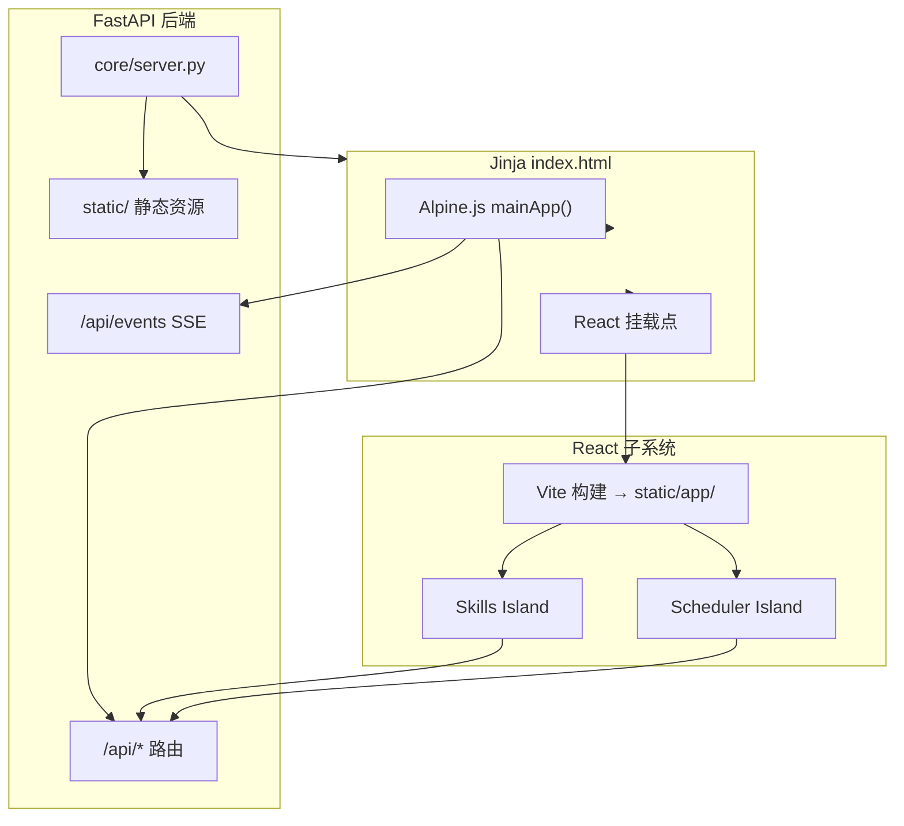
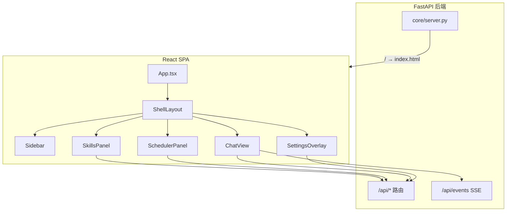
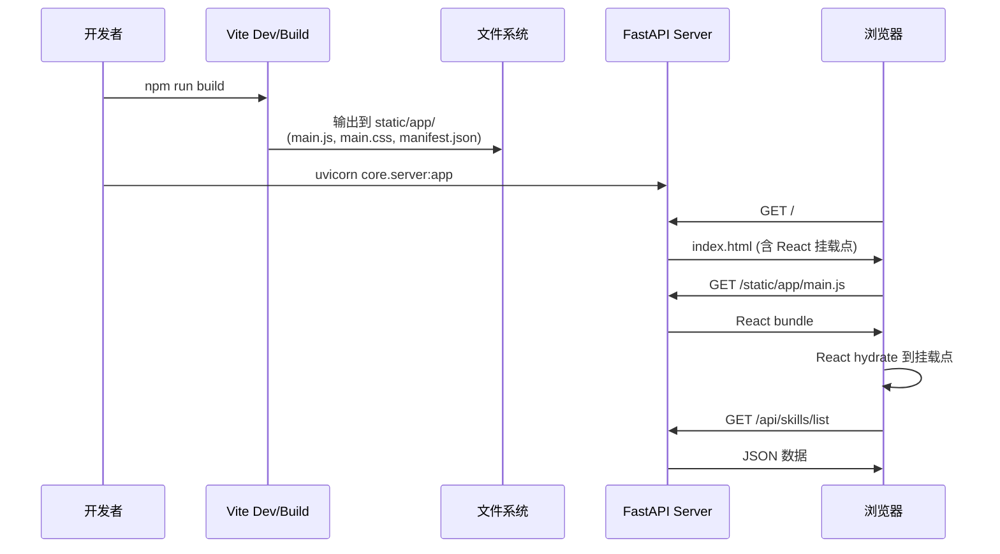
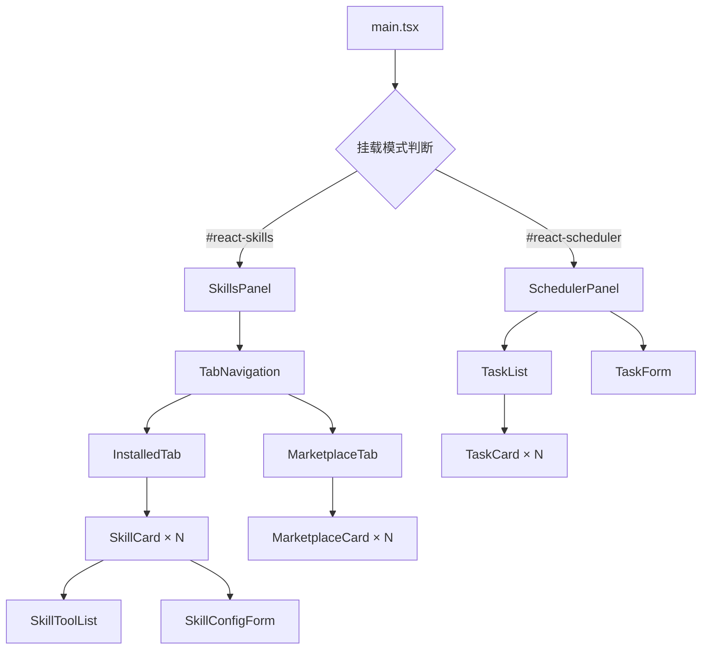

# 设计文档：React 前端渐进式迁移 (react-frontend-migration)

## 概述

本设计文档描述将 openGuiclaw 前端从 Alpine.js + Jinja2 模板架构渐进式迁移到 React 19 + TypeScript + Vite 的技术方案。迁移采用"React Islands"策略——在现有页面中逐步挂载 React 子树，Alpine 与 React 按视图划清 DOM 主控边界，最终过渡到 React SPA。

迁移优先级：先建基座（Phase 0），再迁 skills（Phase 1），接着迁 scheduler（Phase 2），聊天拆为"展示层"和"流式状态层"两步处理（Phase 3-4），设置面板和收尾放到最后。整个过程中现有 FastAPI 后端 API 不做协议变更，React 直接消费现有 ~46 个 `/api/*` 端点。

## 架构

### 阶段一：React Islands 共存架构

React 作为子系统嵌入现有页面，Alpine 继续管理未迁移的视图。两者通过 DOM 挂载点隔离，不共享状态。



### 阶段二：React SPA 接管

核心页面迁移完成后，前端入口切换为 React SPA，Jinja 仅保留兜底职责。



### 构建产物集成流程



## 组件与接口

### 目录结构

```text
frontend/
├── package.json
├── tsconfig.json
├── vite.config.ts
├── src/
│   ├── main.tsx                  # 入口：按挂载点初始化 React Islands
│   ├── App.tsx                   # SPA 阶段的根组件
│   ├── providers.tsx             # QueryClient + Zustand Provider
│   ├── components/
│   │   ├── skills/
│   │   │   ├── SkillsPanel.tsx   # 技能管理主面板
│   │   │   ├── SkillCard.tsx     # 单个技能卡片
│   │   │   ├── SkillToolList.tsx # 原子工具列表
│   │   │   └── MarketplaceTab.tsx# 技能市场标签页
│   │   ├── scheduler/
│   │   │   ├── SchedulerPanel.tsx# 自动化面板
│   │   │   ├── TaskCard.tsx      # 任务卡片
│   │   │   └── TaskForm.tsx      # 任务创建/编辑表单
│   │   └── shell/
│   │       ├── Sidebar.tsx       # 侧边栏（阶段二）
│   │       └── TopBar.tsx        # 顶部栏（阶段二）
│   ├── features/
│   │   ├── skills/
│   │   │   ├── api.ts            # Skills API 请求封装
│   │   │   ├── hooks.ts          # useSkillsQuery, useToggleSkill 等
│   │   │   └── types.ts          # Skill, SkillToggleRequest 等类型
│   │   └── scheduler/
│   │       ├── api.ts            # Scheduler API 请求封装
│   │       ├── hooks.ts          # useSchedulerTasks, useCreateTask 等
│   │       └── types.ts          # SchedulerTask, TriggerType 等类型
│   ├── lib/
│   │   ├── fetcher.ts            # 统一 fetch 封装
│   │   └── sse.ts                # SSE 连接管理
│   └── styles/
│       └── tokens.css            # 复用 shell.css 变量
└── dist/                         # 构建输出 → 复制到 static/app/
```

### 组件层级关系



### 组件接口定义

```typescript
// ── SkillsPanel ──────────────────────────────────────────
interface SkillsPanelProps {
  /** 初始激活的标签页 */
  initialTab?: 'installed' | 'marketplace';
}

// ── SkillCard ────────────────────────────────────────────
interface SkillCardProps {
  skill: Skill;
  onToggle: (name: string, enabled: boolean) => void;
  onSaveConfig: (name: string, config: Record<string, unknown>) => void;
  onUninstall: (name: string) => void;
}

// ── SchedulerPanel ───────────────────────────────────────
interface SchedulerPanelProps {
  /** 无额外 props，数据通过 hooks 获取 */
}

// ── TaskCard ─────────────────────────────────────────────
interface TaskCardProps {
  task: SchedulerTask;
  onToggle: (taskId: string, enabled: boolean) => void;
  onTrigger: (taskId: string) => void;
  onEdit: (task: SchedulerTask) => void;
  onDelete: (taskId: string) => void;
}

// ── TaskForm ─────────────────────────────────────────────
interface TaskFormProps {
  initialData?: Partial<SchedulerTask>;
  onSubmit: (data: TaskFormData) => void;
  onCancel: () => void;
}
```

## 数据模型

### Skills 领域类型

```typescript
/** 技能项（对应 /api/skills/list 返回结构） */
interface Skill {
  id: string;
  name: string;
  description: string;
  category: 'agent_skill' | 'system_skill';
  registry_category: string;
  tools: string[];
  enabled: boolean;
  /** 前端运行时状态 */
  ui_config?: SkillConfigField[];
  config_values?: Record<string, unknown>;
}

interface SkillConfigField {
  key: string;
  label: string;
  type: 'text' | 'secret' | 'select' | 'bool';
  default?: string;
  options?: string[];
}

/** 技能市场项（对应 /api/skills/marketplace 返回结构） */
interface MarketplaceSkill {
  id: string;
  name: string;
  description: string;
  author: string;
  url: string;
  installs: number;
  stars: number;
  tags: string[];
  installed: boolean;
}
```

### Scheduler 领域类型

```typescript
type TriggerType = 'once' | 'daily' | 'weekly' | 'monthly' | 'interval' | 'cron';
type TaskType = 'task' | 'reminder' | 'system';

/** 调度任务（对应 /api/scheduler/tasks 返回结构） */
interface SchedulerTask {
  id: string;
  name: string;
  description: string;
  enabled: boolean;
  task_type: TaskType;
  trigger_type: TriggerType;
  trigger_config: Record<string, unknown>;
  prompt?: string;
  reminder_message?: string;
  action?: string;
  status: 'idle' | 'running' | 'error';
  last_run: string | null;
  next_run: string | null;
  deletable: boolean;
}

/** 任务表单数据 */
interface TaskFormData {
  id?: string;
  name: string;
  description: string;
  enabled: boolean;
  task_type: TaskType;
  trigger_type: TriggerType;
  trigger_config: Record<string, unknown>;
  prompt: string;
  reminder_message: string;
}
```

### 验证规则

- `Skill.name`: 非空字符串，唯一标识
- `Skill.tools`: 字符串数组，可为空（catalog-only 条目）
- `SchedulerTask.name`: 必填，非空
- `SchedulerTask.trigger_config`: 根据 `trigger_type` 动态校验
  - `once`: 需要 `{ time: ISO8601 }`
  - `daily/weekly/monthly`: 需要 `{ time: "HH:MM" }` + 对应日期字段
  - `interval`: 需要 `{ hours?: number, minutes?: number }`
  - `cron`: 需要 `{ cron: string }` 且为合法 cron 表达式
- `TaskFormData.prompt`: 当 `task_type === 'task'` 时必填
- `TaskFormData.reminder_message`: 当 `task_type === 'reminder'` 时必填


## API 请求层设计

### 统一 Fetcher

```typescript
// lib/fetcher.ts
const BASE = '';  // 同源，无需前缀

async function fetcher<T>(
  path: string,
  options?: RequestInit
): Promise<T> {
  const res = await fetch(`${BASE}${path}`, {
    headers: { 'Content-Type': 'application/json', ...options?.headers },
    ...options,
  });
  if (!res.ok) {
    const body = await res.json().catch(() => ({}));
    throw new ApiError(res.status, body.detail || res.statusText);
  }
  return res.json();
}

class ApiError extends Error {
  constructor(public status: number, message: string) {
    super(message);
    this.name = 'ApiError';
  }
}
```

### Skills API 封装

```typescript
// features/skills/api.ts
import { fetcher } from '../../lib/fetcher';
import type { Skill, MarketplaceSkill } from './types';

export const skillsApi = {
  list: () =>
    fetcher<{ skills: Skill[] }>('/api/skills/list'),

  toggle: (name: string, enabled: boolean, tools?: string[]) =>
    fetcher<{ status: string; affected: number }>('/api/skills/toggle', {
      method: 'POST',
      body: JSON.stringify({ name, enabled, tools }),
    }),

  saveConfig: (name: string, config: Record<string, unknown>) =>
    fetcher('/api/skills/config', {
      method: 'POST',
      body: JSON.stringify({ name, config }),
    }),

  reload: () =>
    fetcher('/api/skills/reload', { method: 'POST' }),

  marketplace: (q: string) =>
    fetcher<{ skills: MarketplaceSkill[] }>(`/api/skills/marketplace?q=${encodeURIComponent(q)}`),

  install: (url: string, name?: string) =>
    fetcher('/api/skills/install', {
      method: 'POST',
      body: JSON.stringify({ url, name }),
    }),

  uninstall: (name: string) =>
    fetcher('/api/skills/uninstall', {
      method: 'POST',
      body: JSON.stringify({ name }),
    }),
};
```

### Scheduler API 封装

```typescript
// features/scheduler/api.ts
import { fetcher } from '../../lib/fetcher';
import type { SchedulerTask, TaskFormData } from './types';

export const schedulerApi = {
  list: () =>
    fetcher<{ tasks: SchedulerTask[] }>('/api/scheduler/tasks'),

  create: (data: TaskFormData) =>
    fetcher<SchedulerTask>('/api/scheduler/tasks', {
      method: 'POST',
      body: JSON.stringify(data),
    }),

  update: (taskId: string, data: Partial<TaskFormData>) =>
    fetcher<SchedulerTask>(`/api/scheduler/tasks/${taskId}`, {
      method: 'PUT',
      body: JSON.stringify(data),
    }),

  delete: (taskId: string) =>
    fetcher(`/api/scheduler/tasks/${taskId}`, { method: 'DELETE' }),

  toggle: (taskId: string, enabled: boolean) =>
    fetcher(`/api/scheduler/tasks/${taskId}/toggle`, {
      method: 'POST',
      body: JSON.stringify({ enabled }),
    }),

  trigger: (taskId: string) =>
    fetcher(`/api/scheduler/tasks/${taskId}/trigger`, { method: 'POST' }),
};
```

## TanStack Query Hooks 设计

### Skills Hooks

```typescript
// features/skills/hooks.ts
import { useQuery, useMutation, useQueryClient } from '@tanstack/react-query';
import { skillsApi } from './api';

const SKILLS_KEY = ['skills'] as const;
const MARKETPLACE_KEY = ['skills', 'marketplace'] as const;

/** 获取已安装技能列表 */
export function useSkillsQuery() {
  return useQuery({
    queryKey: SKILLS_KEY,
    queryFn: () => skillsApi.list().then(r => r.skills),
    staleTime: 30_000,
  });
}

/** 切换技能启用/禁用 */
export function useToggleSkill() {
  const qc = useQueryClient();
  return useMutation({
    mutationFn: ({ name, enabled, tools }: {
      name: string; enabled: boolean; tools?: string[];
    }) => skillsApi.toggle(name, enabled, tools),
    onSuccess: () => qc.invalidateQueries({ queryKey: SKILLS_KEY }),
  });
}

/** 保存技能配置 */
export function useSaveSkillConfig() {
  const qc = useQueryClient();
  return useMutation({
    mutationFn: ({ name, config }: {
      name: string; config: Record<string, unknown>;
    }) => skillsApi.saveConfig(name, config),
    onSuccess: () => qc.invalidateQueries({ queryKey: SKILLS_KEY }),
  });
}

/** 搜索技能市场 */
export function useMarketplaceQuery(query: string) {
  return useQuery({
    queryKey: [...MARKETPLACE_KEY, query],
    queryFn: () => skillsApi.marketplace(query).then(r => r.skills),
    enabled: query.length > 0,
    staleTime: 60_000,
  });
}

/** 安装技能 */
export function useInstallSkill() {
  const qc = useQueryClient();
  return useMutation({
    mutationFn: ({ url, name }: { url: string; name?: string }) =>
      skillsApi.install(url, name),
    onSuccess: () => {
      qc.invalidateQueries({ queryKey: SKILLS_KEY });
      qc.invalidateQueries({ queryKey: MARKETPLACE_KEY });
    },
  });
}

/** 卸载技能 */
export function useUninstallSkill() {
  const qc = useQueryClient();
  return useMutation({
    mutationFn: (name: string) => skillsApi.uninstall(name),
    onSuccess: () => qc.invalidateQueries({ queryKey: SKILLS_KEY }),
  });
}
```

### Scheduler Hooks

```typescript
// features/scheduler/hooks.ts
import { useQuery, useMutation, useQueryClient } from '@tanstack/react-query';
import { schedulerApi } from './api';

const TASKS_KEY = ['scheduler', 'tasks'] as const;

/** 获取调度任务列表 */
export function useSchedulerTasks() {
  return useQuery({
    queryKey: TASKS_KEY,
    queryFn: () => schedulerApi.list().then(r => r.tasks),
    staleTime: 15_000,
    refetchInterval: 30_000,  // 自动轮询，因为任务状态会变
  });
}

/** 创建任务 */
export function useCreateTask() {
  const qc = useQueryClient();
  return useMutation({
    mutationFn: schedulerApi.create,
    onSuccess: () => qc.invalidateQueries({ queryKey: TASKS_KEY }),
  });
}

/** 更新任务 */
export function useUpdateTask() {
  const qc = useQueryClient();
  return useMutation({
    mutationFn: ({ taskId, data }: {
      taskId: string; data: Partial<import('./types').TaskFormData>;
    }) => schedulerApi.update(taskId, data),
    onSuccess: () => qc.invalidateQueries({ queryKey: TASKS_KEY }),
  });
}

/** 删除任务 */
export function useDeleteTask() {
  const qc = useQueryClient();
  return useMutation({
    mutationFn: schedulerApi.delete,
    onSuccess: () => qc.invalidateQueries({ queryKey: TASKS_KEY }),
  });
}

/** 切换任务启用状态 */
export function useToggleTask() {
  const qc = useQueryClient();
  return useMutation({
    mutationFn: ({ taskId, enabled }: { taskId: string; enabled: boolean }) =>
      schedulerApi.toggle(taskId, enabled),
    onSuccess: () => qc.invalidateQueries({ queryKey: TASKS_KEY }),
  });
}

/** 立即触发任务 */
export function useTriggerTask() {
  const qc = useQueryClient();
  return useMutation({
    mutationFn: schedulerApi.trigger,
    onSuccess: () => qc.invalidateQueries({ queryKey: TASKS_KEY }),
  });
}
```

## React Islands 挂载机制

### 入口文件

```typescript
// src/main.tsx
import { StrictMode } from 'react';
import { createRoot } from 'react-dom/client';
import { QueryClient, QueryClientProvider } from '@tanstack/react-query';
import { SkillsPanel } from './components/skills/SkillsPanel';
import { SchedulerPanel } from './components/scheduler/SchedulerPanel';
import './styles/tokens.css';

const queryClient = new QueryClient({
  defaultOptions: {
    queries: { retry: 1, refetchOnWindowFocus: false },
  },
});

function mountIsland(elementId: string, Component: React.FC) {
  const el = document.getElementById(elementId);
  if (!el) return;
  const root = createRoot(el);
  root.render(
    <StrictMode>
      <QueryClientProvider client={queryClient}>
        <Component />
      </QueryClientProvider>
    </StrictMode>
  );
}

// 按需挂载：只有对应 DOM 节点存在时才渲染
mountIsland('react-skills', SkillsPanel);
mountIsland('react-scheduler', SchedulerPanel);
```

### index.html 挂载点改造

在现有 `index.html` 中，将 skills 和 scheduler 视图区域替换为 React 挂载点：

```html
<!-- 原 Alpine skills 视图替换为 React 挂载点 -->
<div x-show="currentView === 'skills'" class="shell-view">
    <div id="react-skills"></div>
</div>

<!-- 原 Alpine scheduler 视图替换为 React 挂载点 -->
<div x-show="currentView === 'scheduler'" class="shell-view">
    <div id="react-scheduler"></div>
</div>

<!-- 在 </body> 前加载 React bundle -->
<script type="module" src="/static/app/main.js"></script>
```

### Alpine ↔ React 边界协议

```typescript
// Alpine 通过 x-show 控制视图可见性
// React 组件在 DOM 节点可见时自动获取数据（TanStack Query 的 refetchOnMount）
// 两者不共享状态，通过以下规则隔离：

// 规则 1: DOM 主控权
// - skills 视图: React 独占 #react-skills 内部 DOM
// - scheduler 视图: React 独占 #react-scheduler 内部 DOM
// - chat/home/sidebar: Alpine 继续主控

// 规则 2: 数据源
// - React 组件通过 TanStack Query 直接调用 /api/* 获取数据
// - Alpine 的 mainApp() 中对应的 skills/scheduler 状态可逐步移除
// - 两者不通过 window 全局变量传递数据

// 规则 3: 事件通信（仅在必要时）
// - Alpine → React: CustomEvent on document
// - React → Alpine: CustomEvent on document
// 示例：Alpine 切换到 skills 视图时通知 React 刷新
// document.dispatchEvent(new CustomEvent('view-changed', { detail: { view: 'skills' } }));
```

