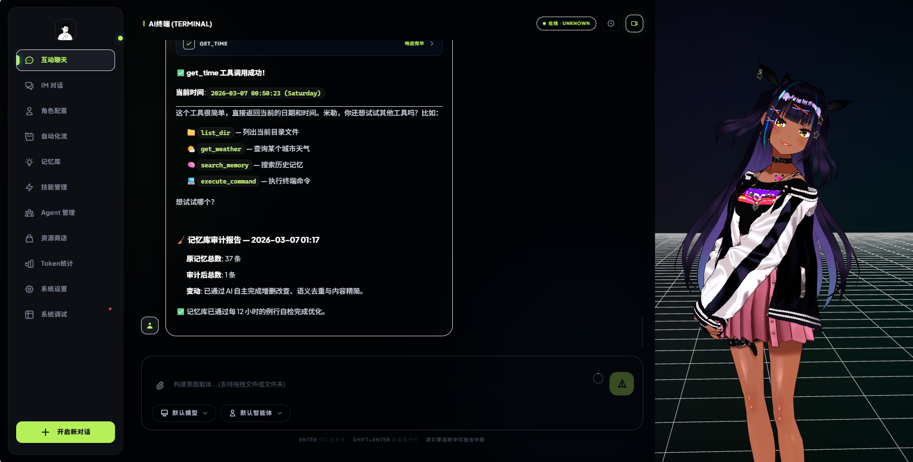

<div align="center">

# 🤖 OpenGuiclaw

**基于 Qwen（通义千问）的智能桌面 AI 伙伴框架**

> 具备视觉感知、GUI 自动化、长期记忆、自我进化与 3D 虚拟形象能力。  
> 提供 **Web UI** 与 **CLI** 两种交互模式，支持 MCP 协议扩展与多 IM 平台接入。

[](./VERSION)
[](https://www.python.org/)
[](#许可证)
[](https://fastapi.tiangolo.com/)
[](https://modelcontextprotocol.io/)

</div>

---

## 📸 界面预览



*左侧为功能面板导航，中央为智能对话区，右侧为 3D VRM 虚拟形象渲染区域*

---

## ✨ 核心能力

### 🧠 智能 Agent 引擎

OpenGuiclaw 的核心是一个完整的 **OpenAI Function Calling** 兼容 Agent，支持多轮工具链自动执行：

- 基于 OpenAI 兼容接口，支持 **Qwen、DeepSeek** 等任意兼容模型
- 原生支持多轮 **Function Calling**，并行工具调用，错误自动重试
- 集成 Qwen 联网搜索（`enable_search`），实时获取最新信息
- 支持图片上传与多模态分析，可独立配置视觉解析模型
- 动态 Token 估算与**滚动摘要**上下文压缩，应对超长对话
- SQLite 持久化 **Token 用量统计**，按模型分组展示

### 👀 视觉感知（主动上下文）

后台独立线程定时截取屏幕，通过 Vision 模型分析当前状态，根据配置**主动发起对话**：

| 模式 | 行为描述 |
|:----:|:--------|
| 🤐 **静默** | 只记录日志，绝不打扰 |
| 😐 **正常** | 检测到报错或长时间空闲时发言 |
| 🤩 **活泼** | 状态变化即主动寒暄，是个话多的 AI 伙伴 |

使用 `/mode` 命令随时切换，或通过 `/poke` 强制触发一次视觉感知。

### 💾 多层记忆系统

| 层次 | 描述 |
|:-----|:-----|
| **短期记忆** | 完整会话历史，自动滚动摘要压缩 |
| **长期记忆** | 自动从对话中提取关键事实，持久化到 `data/` |
| **向量检索 (RAG)** | 基于 `text-embedding-v4` 的语义搜索，让 AI 能"回忆"模糊的往事 |
| **知识图谱** | 实体关系存储，支持 `query_knowledge` 工具复杂查询 |

### 🔄 自我进化引擎

- 每天（或跨天首次启动时）自动**回顾昨日对话日志**
- 提炼新的长期记忆，更新用户画像（User Profile）
- 根据交互历史，自动提议微调 `PERSONA.md` **人设文件**，性格越来越贴合你的偏好

### 🎮 GUI 自动化

- 封装 `pyautogui` + `mss`，支持**点击、双击、拖拽、滚轮、键盘输入**
- 支持基于归一化坐标（0–1000）的视觉定位操作
- `screenshot_and_act` 工具：**截屏 → 视觉模型分析 → 自动执行**，一步完成复杂 UI 任务

### 📋 多步骤计划执行

- `create_plan` 工具将复杂目标分解为多步骤计划
- 三种执行模式：**自驾**（全自动）、**确认**（每步等待确认）、**普通**
- 计划状态实时追踪，支持中途查看进度

### 🎭 3D 虚拟形象（VRM）

Web UI 内置了完整的 VRM 3D 形象渲染系统：

- 基于 **Three.js + @pixiv/three-vrm** 渲染，流畅运行于浏览器
- 内置动画系统（等待、互动等默认动画），自然生动
- 支持上传**自定义 `.vrm` 模型**，即插即用
- 内置**模型商店**，可在线下载更多 VRM 模型和动画包
- **双层控制架构**：系统级开关（`vrmSystemEnabled`）与 UI 抽屉开关（`showVrm`）独立管理，状态通过 `localStorage` 持久化

### 🔌 插件与 MCP 生态

- `plugins/` 目录**热加载**，运行时无需重启
- 内置 **Python 沙箱执行**（RestrictedPython），安全运行动态代码
- **MCP 协议双向支持**：
  - 作为 **MCP 客户端**：通过 `config/mcp_servers.json` 接入 Context7、Playwright 等任意 MCP 服务
  - 作为 **MCP 服务器**：将自身截图/GUI 执行能力暴露给 Claude Desktop、Cursor 等 AI 主机
- AI 可通过 `create_plugin` 工具**自主编写并加载新插件**（自我进化的终极形态）

### 💬 多 IM 平台接入（Channels）

通过标准化 `ChannelGateway` 接入多个即时通讯平台：

| 平台 | 功能特性 |
|:----:|:--------|
| 🔔 **DingTalk（钉钉）** | Stream 模式收发、文本/Markdown/图片、群聊/单聊 |
| 🪶 **Feishu（飞书）** | Webhook 收发、富文本卡片、消息加密验证 |
| ✈️ **Telegram** | 长轮询收发、命令支持、HTTP/SOCKS5 代理 |

---

## 🚀 快速开始

### 前置要求

- Python **3.10+**（推荐使用 [uv](https://docs.astral.sh/uv/) 虚拟环境管理器）
- Node.js **18+**（可选，用于 MCP npx 服务器）
- 阿里云 DashScope API Key（或其他 OpenAI 兼容服务的 Key）

### 1. 安装依赖

```bash
# 推荐使用 uv（速度更快）
uv pip install -r requirements.txt

# 或使用标准 pip
pip install -r requirements.txt
```

### 2. 配置

```bash
# 复制配置模板
cp config.json.example config.json
```

编辑 `config.json`，最小配置只需填入主模型的 API Key：

```json
{
  "active_chat_endpoint_id": "qwen",
  "chat_endpoints": [
    {
      "id": "qwen",
      "name": "通义千问",
      "base_url": "https://dashscope.aliyuncs.com/compatible-mode/v1",
      "api_key": "YOUR_DASHSCOPE_API_KEY",
      "model": "qwen-max"
    }
  ]
}
```

完整配置项请参考 [config.json.example](./config.json.example)。

### 3. 启动

**方式 A：Web UI（推荐）**

```bash
uv run uvicorn core.server:app --host 127.0.0.1 --port 8010 --reload
```

访问 `http://127.0.0.1:8010` 打开图形界面 🎉

**方式 B：命令行模式**

```bash
uv run python main.py
```

---

## ⚙️ 配置说明

| 配置块 | 是否必填 | 用途 |
|:-------|:--------:|:-----|
| `chat_endpoints` | ✅ | 主对话模型列表（支持多个端点轮换） |
| `vision` | 可选 | 视觉感知后台截屏分析模型 |
| `image_analyzer` | 可选 | 用户上传图片的解析模型 |
| `embedding` | 可选 | 向量嵌入模型，用于语义记忆检索（RAG） |
| `autogui` | 可选 | GUI 自动化专用视觉模型 |
| `proactive` | 可选 | 主动感知行为（间隔分钟数、冷却时间、模式） |
| `channels` | 可选 | IM 平台接入配置（DingTalk / Feishu / Telegram） |

> 各模型可配置为同一 API Key 下的不同模型，也可指向完全不同的服务商（如 DeepSeek、OpenAI 等）。

---

## 📁 项目结构

```
openGuiclaw/
├── main.py                    # CLI 入口
├── launcher.py                # 带系统托盘的 GUI 启动器（PyWebview）
├── mcp_server.py              # MCP 服务器模式入口
├── config.json                # 配置文件（本地，不提交 Git）
├── PERSONA.md                 # 默认 AI 人设定义（支持自动进化）
├── VERSION                    # 版本号
│
├── core/                      # 核心模块
│   ├── agent.py               # Agent 主逻辑（LLM 交互、工具分发、Token 统计）
│   ├── server.py              # FastAPI Web 服务 + REST API + SSE 流式输出
│   ├── context.py             # 视觉感知后台线程（截屏、状态分析、主动对话）
│   ├── memory.py              # 长期记忆管理器
│   ├── memory_extractor.py    # 记忆自动提取引擎
│   ├── vector_memory.py       # 向量存储与语义检索（RAG）
│   ├── self_evolution.py      # 自我进化引擎（日志回顾、人设微调）
│   ├── identity_manager.py    # 人设管理器（多人设切换）
│   ├── knowledge_graph.py     # 知识图谱（实体关系存储）
│   ├── session.py             # 会话管理与持久化
│   ├── mcp_client.py          # MCP JSON-RPC 底层客户端
│   ├── skills.py              # 技能注册装饰器系统
│   ├── plugin_manager.py      # 插件热加载管理器
│   ├── bootstrap.py           # 应用启动引导与初始化
│   ├── channels/              # IM 通道系统
│   │   ├── gateway.py         # 统一消息路由网关
│   │   └── adapters/          # 平台适配器（DingTalk、Feishu、Telegram）
│   ├── routes/                # FastAPI 路由模块
│   └── scheduler/             # 定时任务调度器
│
├── plugins/                   # 热加载插件（即改即用）
│   ├── autogui.py             # 屏幕控制（PyAutoGUI + MSS）
│   ├── plan_handler.py        # 多步骤计划执行
│   ├── sandbox_repl.py        # Python 沙箱（RestrictedPython）
│   ├── mcp_gateway.py         # MCP 客户端网关
│   ├── skill_creator.py       # AI 自主创建插件
│   ├── filesystem.py          # 文件系统操作
│   ├── browser.py             # 浏览器自动化
│   ├── scheduled.py           # 定时提醒任务
│   ├── weather.py             # 天气查询
│   └── system.py              # Shell 命令执行
│
├── templates/                 # Jinja2 HTML 模板
│   ├── index.html             # 主页面（Alpine.js 驱动）
│   └── panels/                # 各功能面板（对话、日记、技能、调度器等）
│
├── static/
│   ├── js/                    # 前端逻辑（Alpine.js，vrm-manager.js 等）
│   ├── models/                # VRM 3D 模型文件（.vrm）
│   └── libs/                  # Three.js、@pixiv/three-vrm 等前端库
│
├── data/                      # 运行时数据（自动生成）
│   ├── sessions/              # 会话历史 JSON
│   ├── diary/                 # AI 每日日记
│   ├── identities/            # 人设文件（.md）
│   └── plans/                 # 计划任务记录
│
├── config/
│   └── mcp_servers.json       # MCP 服务器连接配置
│
└── docs/                      # 项目文档
    └── modules/               # 各模块详细文档
```

---

## 🧩 Agent 架构

```
Agent
├── LLM Client (OpenAI SDK)
├── Memory System
│   ├── 短期记忆（Session History）
│   ├── 长期记忆（memory.jsonl）
│   ├── 向量检索（vector_memory.py + text-embedding-v4）
│   └── 知识图谱（knowledge_graph.py）
├── Session Manager（会话历史与持久化）
├── Skills Manager（技能注册与执行）
├── Plugin Manager（热加载插件）
├── Journal Manager（对话日志）
├── Diary Manager（AI 日记）
├── Identity Manager（多人设管理）
├── Self Evolution（进化引擎）
└── Context Manager（视觉感知后台线程）
```

### 多模型配置策略

| 用途 | 推荐模型 | 说明 |
|:-----|:--------:|:-----|
| 主对话 | `qwen-max` | 高质量推理 |
| 自我进化 | `qwen-plus` | 性价比优先，降低成本 |
| 视觉感知 | `qwen-vl-plus` | 屏幕状态分析 |
| 图片解析 | `qwen3-vl-flash` | 快速响应用户上传图片 |
| 向量嵌入 | `text-embedding-v4` | 语义记忆检索 |

---

## 🔌 MCP 集成

OpenGuiclaw 实现了完整的 **MCP 双向集成**：

```
┌─────────────────────────────────────────────────────────────┐
│                     OpenGuiclaw 进程                         │
│                                                             │
│  ┌───────────────────────┐   ┌─────────────────────────┐   │
│  │    客户端方向（消费）   │   │   服务器方向（暴露）      │   │
│  │                       │   │                         │   │
│  │  plugins/mcp_gateway  │   │   mcp_server.py         │   │
│  │     (AI 工具接口)     │   │   (FastMCP 服务器)       │   │
│  └──────────┬────────────┘   └──────────┬──────────────┘   │
└─────────────│───────────────────────────│───────────────────┘
              ▼                           ▼
    外部 MCP 服务器             外部 MCP 客户端
   (Context7, Filesystem      (Claude Desktop,
    Playwright, etc.)          Cursor, etc.)
```

### 接入外部 MCP 服务

编辑 `config/mcp_servers.json`（兼容 Claude Desktop 格式）：

```json
{
  "mcpServers": {
    "context7": {
      "command": "npx",
      "args": ["-y", "@upstash/context7-mcp@latest"]
    },
    "filesystem": {
      "command": "npx",
      "args": ["-y", "@modelcontextprotocol/server-filesystem", "C:/Users/你的用户名"]
    }
  }
}
```

### 将 OpenGuiclaw 接入 Claude Desktop

在 Claude Desktop 的 `claude_desktop_config.json` 中添加：

```json
{
  "mcpServers": {
    "openGuiclaw": {
      "command": "python",
      "args": ["D:/openGuiclaw/mcp_server.py"]
    }
  }
}
```

支持的工具：`capture_screenshot`、`execute_action`、`run_task`、`get_screen_info`

---

## 🔧 扩展开发

### 添加插件

在 `plugins/` 目录下新建 `.py` 文件，实现 `register` 函数：

```python
def register(skills_manager):
    @skills_manager.skill(
        name="my_tool",
        description="工具描述，AI 会根据此描述决定何时调用",
        parameters={
            "properties": {
                "arg": {"type": "string", "description": "参数说明"}
            },
            "required": ["arg"]
        },
        category="utility"  # 用于 Web UI 技能面板分组
    )
    def my_tool(arg: str) -> str:
        return f"执行结果: {arg}"
```

重启服务或在 Web UI 技能面板点击「刷新」即可热加载。也可以直接对 AI 说：「帮我写一个能做 X 的插件」，让 `create_plugin` 工具自动生成！

### 自定义人设

在 `data/identities/` 目录下新建 `<name>.md` 文件，通过 Web UI 人设面板或 `/persona <name>` 指令切换。

自我进化功能会在每日回顾后自动提议更新人设内容，经你确认后生效。

---

## 💬 CLI 常用指令

在命令行模式下，输入以下 Slash 命令进行控制：

| 指令 | 说明 |
|:-----|:-----|
| `/new` | 开启新会话（保存当前对话） |
| `/mode` | 切换视觉感知模式（🤐 静默 / 😐 正常 / 🤩 活泼） |
| `/plan` | 切换计划执行模式（自驾 / 确认 / 普通） |
| `/memory` | 查看所有长期记忆 |
| `/skills` | 列出已加载技能（含插件） |
| `/plugins [reload]` | 查看或热重载插件 |
| `/persona [name]` | 列出或切换人设 |
| `/sessions` | 列出历史会话 |
| `/switch <id>` | 切换到指定历史会话 |
| `/upload <路径> [提示词]` | 上传文件给 AI 分析 |
| `/poke` | 强制触发一次视觉感知 |
| `/context` | 查看视觉感知状态 |
| `/help` | 显示帮助信息 |
| `/quit` | 退出程序 |

---

## 📦 技术栈

| 类别 | 技术 |
|:-----|:-----|
| **后端框架** | FastAPI + Uvicorn + SSE |
| **AI 接口** | OpenAI SDK（兼容 Qwen/DeepSeek 等） |
| **3D 渲染** | Three.js + @pixiv/three-vrm |
| **前端框架** | Alpine.js + Jinja2 |
| **GUI 自动化** | PyAutoGUI + MSS + Pillow |
| **沙箱执行** | RestrictedPython |
| **MCP 协议** | `mcp` SDK + FastMCP + JSON-RPC 2.0 |
| **向量数据库** | JSONL 文件 + NumPy（轻量级本地方案） |
| **IM 平台** | lark-oapi + dingtalk-stream + python-telegram-bot |
| **打包部署** | PyWebview + PyInstaller + Inno Setup |

---

## 📚 文档索引

详细的模块文档位于 [`docs/modules/`](./docs/modules/) 目录：

| 文档 | 说明 |
|:-----|:-----|
| [agent.md](./docs/modules/agent.md) | Agent 核心引擎，Function Calling 机制，Token 管理 |
| [mcp.md](./docs/modules/mcp.md) | MCP 双向集成，客户端网关，服务器模式 |
| [memory.md](./docs/modules/memory.md) | 记忆系统架构，向量检索，RAG 实现 |
| [evolution.md](./docs/modules/evolution.md) | 自我进化引擎，日志回顾，人设微调 |
| [plugins.md](./docs/modules/plugins.md) | 插件系统，热加载机制，开发指南 |
| [skills.md](./docs/modules/skills.md) | 技能注册，内置技能列表 |
| [channels.md](./docs/modules/channels.md) | IM 通道系统，多平台适配器 |
| [identity.md](./docs/modules/identity.md) | 人设管理，自动进化，多人设切换 |
| [context.md](./docs/modules/context.md) | 视觉感知，主动交互，模式控制 |
| [session.md](./docs/modules/session.md) | 会话管理，历史持久化 |
| [scheduler.md](./docs/modules/scheduler.md) | 定时任务调度器 |
| [bootstrap.md](./docs/modules/bootstrap.md) | 应用启动引导 |

---

## ⚠️ 注意事项

> [!WARNING]
> `config.json` 包含 API Key，已加入 `.gitignore`，**请勿提交到版本控制系统**。

> [!NOTE]
> 视觉感知功能会定时截屏。图片**仅临时发送**给配置的 LLM API 进行分析，**不会保存到本地硬盘**（仅内存处理，分析完即丢弃）。

> [!TIP]
> 开启视觉感知会产生额外的 Vision 模型 API 费用。可通过 `/mode` 切换到**静默模式**降低消耗。

> [!CAUTION]
> 自我进化功能会修改 `PERSONA.md` 和记忆文件，建议**定期备份 `data/` 目录**。

---

## 🤝 贡献指南

欢迎提交 Issue 和 Pull Request！

1. Fork 本仓库
2. 创建功能分支：`git checkout -b feature/my-feature`
3. 提交变更：`git commit -m 'feat: 添加新功能'`
4. 推送分支：`git push origin feature/my-feature`
5. 打开 Pull Request

**开发建议**：
- 新增能力优先考虑以**插件形式**实现（`plugins/` 目录），保持核心简洁
- 遵循现有的技能注册装饰器模式，参考 [`plugins/basic.py`](./plugins/basic.py)
- 复杂的多服务仓集成建议通过 **MCP 协议**接入，而非直接修改核心代码

---

## 📄 许可证

本项目基于 [MIT 许可证](./LICENSE) 开源。

---

<div align="center">

**如果这个项目对你有帮助，请给一个 ⭐ Star！**

*OpenGuiclaw — 让每一台电脑都有一个懂你的 AI 伙伴* 🤖

</div>
