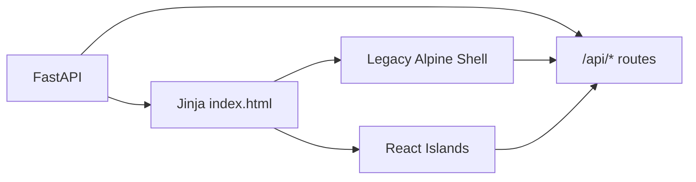
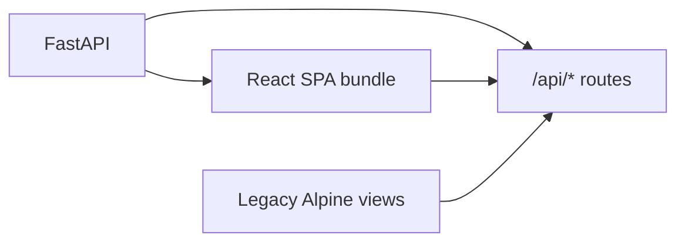

# OpenGuiclaw React 演进方案

> **Status**: In Progress | **Last Updated**: 2026-03-18 | **Purpose**: 基于当前代码结构，给出是否适合迁移到 React 的判断，以及一份可执行的渐进式迁移路线图，并记录阶段性审计结论

## Table of Contents

- [结论](#结论)
- [现状证据](#现状证据)
- [为什么适合渐进迁移](#为什么适合渐进迁移)
- [目标架构](#目标架构)
- [推荐技术栈](#推荐技术栈)
- [迁移阶段](#迁移阶段)
- [目录建议](#目录建议)
- [风险与规避](#风险与规避)
- [完成标准](#完成标准)
- [阶段审计](#阶段审计)
- [下一步建议](#下一步建议)
- [建议的第一步](#建议的第一步)

---

## 结论

**这个项目适合进化为 React 架构，但不适合一次性重写。**

更准确地说:

- 当前前端复杂度已经超出 `Jinja + Alpine + 全局对象` 的舒适区
- 后端 FastAPI API 边界已经足够清晰，具备接入 React 的条件
- 但现有页面和逻辑耦合度较高，整站推翻重做的回归风险很大
- 最优路径是先建立 React 前端基座，再按模块逐块替换

一句话判断:

> **适合迁移，且迁移收益明显；但必须采用“渐进演进”而不是“大爆炸重写”。**

---

## 现状证据

### 1. 前端状态已经高度集中

目前主前端逻辑主要集中在两个超大脚本中:

| 文件 | 行数 | 说明 |
| --- | ---: | --- |
| `static/js/app-logic.js` | 2771 | 聊天、配置、技能、自动化、会话、上传、Token 统计等核心状态和行为 |
| `static/js/workspace-logic.js` | 960 | 工作区 shell、侧边栏、线程、设置弹层和主视图切换 |

这说明前端已经从“轻交互页面增强”演变成了“单页应用式状态系统”，只是目前仍由 Alpine 全局对象承载。

### 2. 模板层 Alpine 指令密度较高

统计 `templates/panels` 后，指令最密集的模板包括:

| 模板 | Alpine 指令数 |
| --- | ---: |
| `panel_config.html` | 150 |
| `chat_area.html` | 76 |
| `panel_agents.html` | 56 |
| `panel_skills.html` | 53 |
| `chat_view.html` | 46 |
| `panel_scheduler.html` | 44 |

这通常意味着:

- 展示层和状态层耦合过深
- 组件复用成本高
- 修改交互时容易牵连整块模板
- 局部 bug 修复容易演变为“模板 + JS + 样式”联动修改

### 3. 前端已经在消费稳定 API，而不是强依赖服务端模板变量

当前前端直接调用了约 **46** 个 `/api/*` 接口路径，主要集中在:

- 工作区与线程
- 聊天与流式响应
- 配置与模型端点
- 技能管理
- 自动化任务
- 记忆、诊断、VRM、IM

这意味着 UI 层已经有比较清晰的后端边界，React 可以作为新的前端壳逐步接入，而不需要先重构后端。

### 4. 服务端入口天然适合作为 React 宿主

当前服务端由 FastAPI 提供 API，并通过 Jinja 返回统一入口页:

- `core/server.py` 中 `/` 路由返回 `index.html`
- 各业务接口已经拆分到 `core/routes/*.py`

这非常适合两种演进方式:

1. **先在现有页面中挂载 React 子树**
2. **后续再切换到单独的 React SPA 入口**

### 5. 构建层仍然偏“脚本直出”

当前首页直接通过 CDN 引入:

- Alpine.js
- Tailwind CDN
- Marked

仓库根目录没有现成的前端工程配置文件:

- 没有 `package.json`
- 没有 `vite.config.*`
- 没有 `tsconfig.json`

这意味着如果开始 React 化，第一步不仅是“写组件”，还需要建立一套最小可维护的前端构建链。

---

## 为什么适合渐进迁移

### 适合迁移的原因

- **状态复杂度已达到 SPA 级别**，继续堆 Alpine 会越来越难维护
- **聊天流式更新、工具卡片、技能与自动化列表** 都非常适合 React 的组件化和局部状态组织
- **后端 API 边界清晰**，迁移时不必同步改后端协议
- **现有视觉系统已相对成型**，可以先复用 `shell.css` 与设计 token，不必先重做 UI

### 不适合一次性重写的原因

- 当前系统同时包含聊天、工作区、设置、技能、自动化、VRM、IM 等多块能力
- 聊天流式交互和工具调用块是高风险区域，重写容易引入行为回归
- 现有桌面 GUI 集成依赖现成页面结构，一次性替换全部入口风险过高

---

## 目标架构

推荐分两层理解:

### 阶段一目标

保留 FastAPI 和现有页面入口，先把 React 作为新前端子系统接入。



这个阶段的目标不是替换整个站，而是让新模块先不再继续堆进 `mainApp()`。

### 阶段二目标

当核心页面迁移到 React 后，再把前端入口切换为 React SPA，Jinja 只保留兜底或极少数静态页面职责。



最终目标:

- React 负责交互层和组件组织
- FastAPI 负责 API、SSE、文件与桌面集成
- Jinja 退出主交互层，仅保留必要静态模板能力

---

## 推荐技术栈

建议选择“保守但现代”的组合，避免一开始就引入太多新概念。

| 领域 | 建议 | 原因 |
| --- | --- | --- |
| UI 框架 | React 19 | 生态成熟，适合组件化和流式状态更新 |
| 语言 | TypeScript | 当前前端状态量大，类型约束能显著降低迁移期回归 |
| 构建 | Vite | 接入成本低，适合从零建立前端工程 |
| 服务端数据 | TanStack Query | 把 `loadSkills`、`loadSchedulerTasks`、配置读取等请求从手写状态迁到可缓存查询 |
| 本地 UI 状态 | Zustand | 比全局大对象更容易拆模块，负担小于 Redux |
| 样式策略 | 先复用 `shell.css` + CSS variables | 降低视觉回归，先迁交互，后做样式工程化 |
| Markdown 渲染 | 保留现有 `marked` 能力，封装到 React 组件 | 降低聊天区迁移成本 |

### 当前不建议一开始就做的事情

- 不建议先引入复杂的微前端方案
- 不建议先大规模重写设计系统
- 不建议先把 VRM 3D 部分 React 化
- 不建议先上 Redux、SSR、Next.js 这类额外复杂度

---

## 迁移阶段

## 阶段 0: 建立 React 基座

目标: 在不影响现有功能的前提下，把 React 工程放进仓库并能构建出一个最小页面。

建议动作:

1. 新增 `frontend/` 目录
2. 初始化 `package.json`、`vite.config.ts`、`tsconfig.json`
3. 输出打包产物到 `static/app/`
4. 在 `index.html` 中预留 React 挂载点
5. 保持 Alpine 与 React 并存

阶段产出:

- React 能成功渲染一个最小占位页面
- FastAPI 能继续正常启动
- 现有 Alpine 页面不受影响

## 阶段 1: 先迁壳层，不迁聊天内核

目标: 先把最稳定的页面框架迁过去，而不是一开始碰流式聊天。

优先迁移:

- 顶部栏
- 左侧工作区/快捷入口壳层
- `skills` 页面容器
- `scheduler` 页面容器

保留:

- 聊天主流程仍然走 Alpine
- 设置弹层先保持现状

这样做的好处:

- 能快速验证 React 与现有 API 的协作方式
- 不会一上来就碰最复杂的流式交互

## 阶段 2: 迁移技能管理和自动化面板

目标: 把最典型的“列表 + 表单 + 局部交互”模块迁成 React。

推荐顺序:

1. `skills`
2. `scheduler`

原因:

- 两者 API 边界清晰
- 交互结构明确
- 视觉上已接近“卡片列表型应用”
- 对话流和输入法等复杂边界较少

这一阶段最好同时引入:

- `useSkillsQuery`
- `useSchedulerTasksQuery`
- `useMutation` 封装的增删改操作

完成后收益会非常直接:

- 从 `mainApp()` 中拔掉一批业务状态
- 后续 UI 修改不再需要穿梭于大模板和全局对象之间

## 阶段 3: 迁移聊天展示层

目标: 先迁“消息渲染”，后迁“消息生产”。

拆分建议:

1. `MessageList`
2. `UserMessageBubble`
3. `AssistantMessage`
4. `ThinkingBlock`
5. `ToolCallCard`
6. `AskUserBlock`
7. `Composer`

这里的关键原则:

- **先保持现有消息数据结构**
- **不要第一版就改后端流式协议**
- **先把 Alpine 模板翻译成 React 组件，再逐步整理状态**

这会显著降低聊天区回归风险。

## 阶段 4: 迁移聊天状态与流式处理

目标: 把当前聊天数据流从 `mainApp()` 中抽离。

建议把以下逻辑独立成模块:

- 会话加载
- 消息标准化
- 流式 chunk 组装
- 工具调用块状态更新
- 中断请求控制
- 输入区附件与 slash command 状态

适合形成:

- `useChatSession`
- `useChatStream`
- `normalizeChatMessage`
- `chatApi.ts`

这是最难但收益最高的一步。

## 阶段 5: 迁移设置页和配置面板

目标: 把 `panel_config.html` 这种高密度模板从 Alpine 中拆出来。

优先迁移子域:

- 模型端点配置
- Role endpoints
- 渠道健康检查
- MCP 服务管理

`panel_config.html` Alpine 指令最多，React 化收益非常大，但建议放在聊天之后，因为它虽然复杂，却不是最高频用户路径。

## 阶段 6: 收尾和清理

目标: 逐步缩减 Alpine 责任，最终决定是否保留。

完成后可以考虑:

- 删除已废弃模板片段
- 把 `mainApp()` 缩成兼容层
- 将 `workspace-logic.js` 中 React 已接管的视图状态移出
- 视情况将 `/` 入口改为 React SPA

---

## 目录建议

建议新增如下前端结构:

```text
frontend/
  src/
    app/
      App.tsx
      providers.tsx
      router.tsx
    components/
      chat/
      scheduler/
      skills/
      shell/
      settings/
    features/
      chat/
        api.ts
        hooks.ts
        types.ts
        utils.ts
      scheduler/
        api.ts
        hooks.ts
        types.ts
      skills/
        api.ts
        hooks.ts
        types.ts
      workspace/
        api.ts
        hooks.ts
        types.ts
    lib/
      fetcher.ts
      sse.ts
      markdown.ts
      time.ts
    store/
      ui-store.ts
      workspace-store.ts
    styles/
      tokens.css
      app.css
    mount/
      skills-root.tsx
      scheduler-root.tsx
      shell-root.tsx
```

### 设计原则

- `features/` 放业务边界
- `components/` 放纯展示组件
- `store/` 只放前端本地状态
- `lib/` 放跨模块基础能力
- 第一阶段支持“按页面挂载”

---

## 风险与规避

| 风险 | 描述 | 规避策略 |
| --- | --- | --- |
| 聊天流式回归 | 工具调用卡片、thinking block、流式拼接容易坏 | 先迁展示层，保留现有消息结构和后端协议 |
| 样式回归 | 当前视觉大量依赖 `shell.css` 和 Tailwind CDN 类名 | 第一阶段复用现有 CSS token，不先做样式重构 |
| 双栈复杂度 | Alpine 和 React 并存一段时间，状态源容易打架 | 明确“某个视图只允许一个框架主控” |
| 打包接入成本 | 当前没有现成前端工程 | 第一阶段只做 Vite 最小集成，不引入额外复杂工具 |
| VRM 集成耦合 | Three.js 与现有页面结构有绑定 | VRM 留到后期，先维持独立模块 |
| 桌面端兼容性 | GUI 包装层可能依赖当前入口行为 | 每一阶段都以现有 FastAPI + GUI 启动链路为基准回归 |

> [!IMPORTANT]
> 最需要避免的不是“React 接不进去”，而是“React 和 Alpine 同时控制同一块 DOM”。迁移过程中必须按视图划清主控边界。

---

## 完成标准

可以把迁移是否成功，定义为下面这些可验证结果:

### 第一阶段完成标准

- React 工程可以独立构建
- FastAPI 能稳定提供 React 打包产物
- `skills` 或 `scheduler` 至少有一个页面完全由 React 渲染
- 现有聊天和设置功能不回归

### 中期完成标准

- `skills`、`scheduler`、`chat` 展示层都已 React 化
- `mainApp()` 中对应状态明显缩减
- 新增页面功能时不再优先写 Alpine 模板

### 最终完成标准

- 主交互壳层与高频页面已由 React 接管
- Alpine 仅保留少量兼容职责，或完全退出
- 前端具备模块化目录、类型约束、可维护的请求层和状态层

---

## 阶段审计

> 审计时间：2026-03-18  
> 审计依据：当前仓库代码、`frontend/src/main.tsx` 挂载点、`templates/index.html`、`templates/panels/*.html`、`static/js/*.js`

### 审计结论

**React 演进未全部完成，当前处于“中后期，但尚未收尾”的状态。**

更准确地说：

- React 基座已经建立并稳定工作
- 多个高频视图已经由 React 接管
- 但核心状态仍然依附 Alpine 全局宿主对象
- 设置页主体、聊天状态层、模块化目录与请求层尚未按目标架构完成
- 当前不能认定为“最终完成标准已满足”

### 当前实现与计划对照

| 阶段 | 计划目标 | 当前状态 | 审计结论 | 证据 |
| --- | --- | --- | --- | --- |
| 阶段 0 | 建立 React 基座、Vite、TS、挂载点、产物输出 | 已有 `frontend/`、Vite、TS、`static/app/main.js`、Jinja 页面接入 bundle | **已完成** | `frontend/package.json`、`templates/index.html`、`frontend/src/main.tsx` |
| 阶段 1 | 先迁壳层，不迁聊天内核 | sidebar、home、workspace modal、settings button、topbar toolbar 已有 React 组件 | **已完成** | `WorkspaceSidebar.tsx`、`HomeWorkspaceDashboard.tsx`、`WorkspaceCreateModal.tsx`、`SettingsButton.tsx`、`ChatThreadToolbar.tsx` |
| 阶段 2 | 迁移 skills / scheduler | skills 与 scheduler 均已有 React 面板并替换 legacy root | **已完成** | `SkillsQuickPanel.tsx`、`SchedulerPanel.tsx` |
| 阶段 3 | 迁移聊天展示层 | 消息列表、输入区、顶部线程工具栏均已 React 化 | **基本完成** | `ChatMessageList.tsx`、`ChatComposer.tsx`、`ChatThreadToolbar.tsx` |
| 阶段 4 | 迁移聊天状态与流式处理 | React 仍通过 `window.__openGuiclawApp` 读取宿主状态，未形成独立 `chatApi/useChatStream/useChatSession` | **未完成** | `bridge/openGuiclaw.ts`、`useWorkspaceShellBridge.ts`、`static/js/app-logic.js` |
| 阶段 5 | 迁移设置页和配置面板 | 仅 settings 左侧导航与头部 React 化，主体内容仍是 `panel_config.html` Alpine 模板 | **部分完成** | `SettingsOverlay.tsx`、`templates/panels/settings_overlay.html`、`templates/panels/panel_config.html` |
| 阶段 6 | 收尾和清理，缩减 Alpine 责任 | `mainApp()` 仍承载大量状态；`app-logic.js`、`workspace-logic.js` 仍然很大 | **未完成** | `static/js/app-logic.js`、`static/js/workspace-logic.js` |

### 已完成项

- React 工程已接入并能独立构建
- `npm run typecheck` 可通过
- `npm run build` 可通过
- `skills`、`scheduler`、`home`、`sidebar`、`workspace modal`、`chat 展示层` 已有 React 接管
- 设置页壳层已有 React 接管：settings 按钮、settings nav、settings header
- 设置页主体已有 8 个内容区完成 React 化：`models`、`archived`、`mcp`、`memory`、`tokens`、`integrations`、`identity`、`diagnostics`

### 未完成项

- 聊天状态层未从 Alpine / 全局对象抽离
- 设置页主体仍未大面积按域迁成 React，当前已完成 `models`、`archived`、`mcp`、`memory`、`tokens`、`integrations`、`identity`、`diagnostics`
- `panel_config.html` 仍然是高密度 Alpine 模板
- 目标目录结构中的 `app/`、`features/`、`store/`、`lib/` 尚未建立
- 未引入计划中的请求层 / 状态层抽象，如 TanStack Query、Zustand 或等价实现
- `mainApp()` 还不是兼容层，而仍是主要状态中心

### 与“最终完成标准”的差距

以下标准尚未满足：

- Alpine 仅保留少量兼容职责，或完全退出
- 前端具备模块化目录、可维护的请求层和状态层
- 主交互壳层虽然大多已接管，但高复杂业务状态尚未真正转移到 React

---

## 下一步建议

### 推荐的下一步

**下一步优先做“阶段 5 的第一块”：把设置页主体从 Alpine 中拆出一个完整 React 子域，先从 `archived` 开始。**

推荐原因：

- 风险低于直接动聊天流式状态
- 与当前正在修改的设置页工作连续
- 能真正推进“settings 不只是壳层 React 化，而是内容区也 React 化”
- `archived` 业务边界相对清晰，适合作为设置主体 React 化的第一块试点

### 建议执行顺序

1. 新建 `frontend/src/features/settings/` 或 `frontend/src/components/settings/` 子目录
2. 把 `archived` 面板迁成 React 组件，并在 `settings_overlay.html` 中为它预留独立 root
3. 让 React 直接消费 `/api/workspaces/archived` 及相关归档接口，而不是继续通过 Alpine 模板中转
4. 完成后再按顺序迁移：
   - 模型端点配置
   - role endpoints
   - 渠道健康检查
5. 当 settings 主体有 2-3 个 tab 完成 React 化后，再回头抽聊天状态层

### 为什么不是先做阶段 4

聊天状态层抽离是收益最高的一步，但也是当前风险最大的一步。按照现状，更稳妥的顺序是：

- 先用设置页主体 React 化继续扩大“React 真正控制业务区”的范围
- 同时整理目录结构与数据访问方式
- 再在结构更清晰的前提下进入聊天状态层抽离

### 具体到当前仓库，我建议的下一个可执行任务

**继续把设置页主体按业务域迁成 React。`models`、`archived`、`mcp`、`memory`、`tokens`、`integrations`、`identity`、`diagnostics` 已完成，下一块建议优先迁 `agent`。**

做到这一步后，设置页主体里偏展示型和轻交互型页签已经基本到位，接下来最值得投入的是模型配置和 role endpoints 这些真正仍被 Alpine 重度占用的编辑区。

---

## 建议的第一步

如果从今天开始推进，建议按下面顺序执行:

1. 建立 `frontend/` + Vite + React + TypeScript 最小工程
2. 在当前 `index.html` 中为 `skills` 页面预留 React 挂载点
3. 先把 `skills` 整页迁成 React
4. 再迁 `scheduler`
5. 验证“React 子树 + FastAPI API + 现有桌面 GUI”这一组合稳定可用

推荐原因:

- `skills` 是最适合的第一块练手区
- 它能验证请求层、列表渲染、表单交互、样式复用、局部状态拆分
- 即使出问题，影响面也比聊天区小很多

---

## 额外建议

这次迁移建议把目标明确成:

**不是“把 Alpine 全部换成 React”，而是“把前端从大模板脚本模式，进化到模块化组件模式”。**

React 只是实现这件事的最合适路径之一。对这个项目来说，真正的收益来自:

- 状态边界清晰
- 组件职责清晰
- 请求层统一
- 高风险交互可测试
- 后续新增功能不再堆进 `mainApp()`

只要沿着这个方向推进，React 迁移就会是一次“降低长期复杂度”的演进，而不是一轮昂贵的重写。
