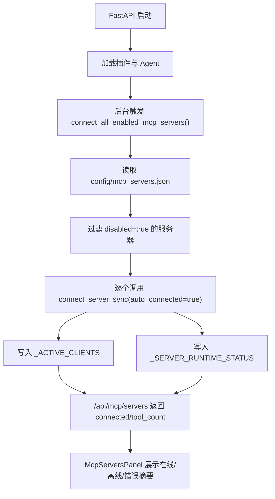

# MCP 自动全连接（对齐 OpenAkita 体验）

## 背景

在本次改造前，OpenGuiclaw 的 MCP 客户端网关采用的是**懒连接**模式：

- MCP 服务器配置存放在 `config/mcp_servers.json`
- 设置面板只负责展示配置和连接状态
- 只有在用户手动点击“连接”，或 Agent 首次调用某个 MCP 工具时，才会真正建立连接

这套设计的优点是资源占用低，但首次使用 MCP 时会有明显的“还没连上”的落差，不符合 `OpenAkita` 风格的“打开即就绪”体验。

本次改造将其调整为：

- **应用启动后自动连接所有未禁用 MCP 服务器**
- 单个服务器的手动连接 / 断开仍然保留
- 工具调用侧的按需自动连接仍然保留，作为兜底

## 新设计

### 1. 启动即自动连接

后端在应用启动完成后，会后台触发一次 MCP 批量连接：

- 遍历 `config/mcp_servers.json` 中的 `mcpServers`
- 对所有 `disabled != true` 的服务器逐个调用连接逻辑
- 某个服务器失败不会阻断其它服务器
- 整个过程在后台执行，不阻塞 Web UI 对外提供服务

### 2. 运行时状态记录

`plugins/mcp_gateway.py` 新增了一份轻量运行时状态缓存，用于描述每个服务器最近一次连接尝试的结果。

每个服务器会记录：

- `last_connect_attempt_at`：最近一次尝试连接的时间
- `last_connect_error`：最近一次失败原因
- `last_connect_result`：最近一次结果，可能为：
  - `connected`
  - `error`
  - `timeout`
  - `not_attempted`
- `auto_connected`：最近一次连接是否由启动自动连接触发

这份状态不会写入磁盘，只存在于当前后端进程生命周期中。

### 3. 前端状态可视化

`GET /api/mcp/servers` 的每个服务器状态项新增上述运行时字段，前端 MCP 面板会直接展示：

- 已在线的服务器：显示“在线”
- 启动自动连接失败的服务器：显示“离线”，并展示失败摘要
- 尚未尝试连接的服务器：显示等待连接或禁用提示

这样即使自动连接失败，用户也能直接看到原因，而不是只看到一个模糊的“离线”状态。

## 数据流



## 与旧方案的差异

| 项目 | 旧方案 | 新方案 |
| --- | --- | --- |
| 首次连接时机 | 手动点击或首次调用工具 | 应用启动后自动连接 |
| 启动阶段可用性 | MCP 默认多为离线 | 多数 MCP 启动后即在线 |
| 失败展示 | 主要靠手动连接时报错 | 面板直接展示最近失败状态 |
| 单个服务器手动连接 | 支持 | 继续支持 |
| 工具调用按需自动连接 | 支持 | 继续支持 |

## 接口变化

`GET /api/mcp/servers` 返回的 `servers[]` 项新增：

```json
{
  "last_connect_attempt_at": "2026-03-26T10:00:00+00:00",
  "last_connect_error": "连接失败: context7",
  "last_connect_result": "error",
  "auto_connected": true
}
```

说明：

- 这些字段是**运行时状态**，不是配置字段
- 本次没有修改 `config/mcp_servers.json` 的结构
- 本次没有新增 `auto_connect` 配置开关，默认所有未禁用服务器都会在启动时尝试连接

## 失败策略

本次采用的是“**静默继续 + 状态展示**”：

- 如果某个 MCP 连接失败，不阻塞应用启动
- 不中断剩余 MCP 的连接过程
- 错误会被记录在运行时状态中，并通过 API 返回给前端

这样可以兼顾启动体验与健壮性，避免因为单个外部工具故障影响整个桌面端。

## 常见失败场景与排障

### 1. MCP SDK 未安装

**现象：**

- MCP 面板提示 SDK 不可用
- 自动连接全部失败

**处理：**

```bash
pip install mcp
```

### 2. `npx` 包不存在或首次安装卡住

**现象：**

- 自动连接超时
- `last_connect_result = timeout`

**处理：**

- 检查本机 Node.js / npm / npx 是否可用
- 手动执行对应命令确认：

```bash
npx -y @upstash/context7-mcp@latest
```

### 3. 环境变量缺失

**现象：**

- 某些 MCP 服务依赖 `env`
- 自动连接报权限或鉴权错误

**处理：**

- 检查 `config/mcp_servers.json` 中的 `env`
- 若用了 `${VAR}` 写法，确认宿主环境变量已经存在

### 4. 单个服务失败但其它服务正常

**现象：**

- 某个服务离线，其它服务在线

**说明：**

- 这是本次设计的预期行为
- 单点失败不会阻断整体启动

## 相关代码

- 启动接入：`core/server.py`
- 网关状态与批量连接：`plugins/mcp_gateway.py`
- 状态接口：`core/routes/config.py`
- 前端展示：`frontend/src/components/McpServersPanel.tsx`

## 后续可扩展方向

1. 为单个 MCP 增加可选的 `auto_connect: false`
2. 提供“全部重连”按钮
3. 面板展示最近一次连接时间格式化文案
4. 为自动连接失败增加更细粒度的错误分类
