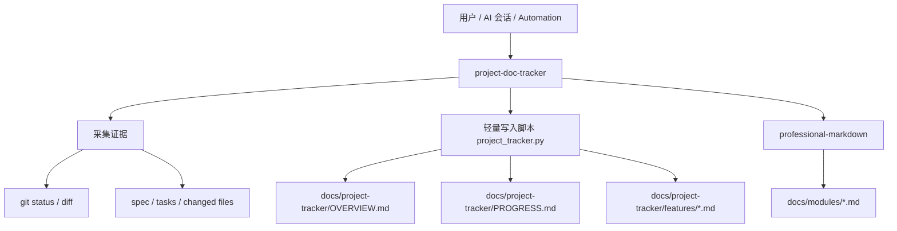

# Project Doc Tracker 模块文档

> **状态**: Stable | **最后更新**: 2026-03-13 | **定位**: 项目长期记忆与正式文档调度模块

## 目录

- [概述](#概述)
- [设计目标](#设计目标)
- [整体架构](#整体架构)
- [核心工作流](#核心工作流)
- [目录与文件结构](#目录与文件结构)
- [脚本接口](#脚本接口)
- [与 professional-markdown 的协作](#与-professional-markdown-的协作)
- [使用建议](#使用建议)
- [已知限制](#已知限制)
- [后续优化方向](#后续优化方向)

---

## 概述

`project-doc-tracker` 用于把项目推进过程中的关键信息沉淀为仓库内的长期记忆，包括：

- 当前活跃事项
- 阶段性进展日志
- 轻量功能说明卡片
- 正式模块文档链接

它本身不负责生成超长正式文档，而是负责识别“哪些功能已经成熟到值得沉淀”，再把正式成文交给 `professional-markdown`。

---

## 设计目标

| 目标 | 说明 |
| --- | --- |
| 防遗忘 | 把会话级进展转成仓库内文档，而不是只留在聊天上下文里 |
| 可恢复 | 让 AI 或开发者在隔一段时间后快速知道“做到哪了” |
| 轻重分层 | tracker 保持轻量，正式文档交给专门文档 skill |
| 低漂移 | 用脚本维护固定格式，减少 Markdown 结构长期漂移 |
| 可扩展 | 未来可接 automation、git 分析和批量文档生成 |

---

## 整体架构



---

## 核心工作流

### 1. 初始化

这里的“初始化”指创建和引导 `docs/project-tracker/`、`OVERVIEW.md`、`PROGRESS.md` 和 `features/` 这套长期记忆文档体系，而不是项目运行环境初始化。

如果仓库里已经存在成型代码，初始化阶段还应顺手完成三件事：

- 回填初始 `OVERVIEW.md`
- 为主要模块补齐基础 feature notes
- 标记后续适合提升为正式文档的候选模块

### 2. 记录会话

每次重要修改后，先看代码与 spec 证据，再写一条结构化 `PROGRESS.md` 日志，并同步更新 `OVERVIEW.md` 的摘要与下一步。

### 3. 维护轻量卡片

对每个功能维持一份简洁说明卡片，记录背景、当前实现、关键文件、风险、后续建议和正式文档链接。

### 4. 提升为正式文档

当功能达到 `done` 或 `stable`，通过 `professional-markdown` 生成正式模块文档，并把链接回填到 tracker。

---

## 目录与文件结构

```text
docs/project-tracker/
├─ OVERVIEW.md
├─ PROGRESS.md
└─ features/
   └─ <feature-id>.md

.agents/skills/project-doc-tracker/
├─ SKILL.md
├─ scripts/project_tracker.py
└─ references/
```

关键文件：

| 文件 | 作用 |
| --- | --- |
| `.agents/skills/project-doc-tracker/SKILL.md` | 定义触发条件、模式和协作边界 |
| `.agents/skills/project-doc-tracker/scripts/project_tracker.py` | 负责轻量 tracker 文档的稳定写入 |
| `.agents/skills/project-doc-tracker/references/workflow.md` | 说明 init/log/promote-to-doc 等模式 |
| `.agents/skills/project-doc-tracker/references/tracker-format.md` | 说明 tracker 的文档格式 |

---

## 脚本接口

当前脚本支持以下命令：

| 命令 | 作用 |
| --- | --- |
| `init` | 初始化 tracker 根目录 |
| `log` | 追加结构化会话日志 |
| `sync-item` | 按 `feature_id` 合并更新概览事项行，并维护分项的下一步与阻塞 |
| `feature-note` | 更新轻量功能卡片 |
| `status` | 读取概览和最近若干条日志 |

> [!NOTE]
> `feature_id` 现在要求使用 slug 风格标识符，只允许字母、数字、`-` 和 `_`，避免路径穿越把文件写到 `features/` 目录之外。

> [!IMPORTANT]
> `project_tracker.py` 不负责生成正式长文档。长文档直接由 `professional-markdown` 输出，避免职责重叠。

---

## 与 professional-markdown 的协作

推荐协作边界如下：

| 模块 | 负责内容 |
| --- | --- |
| `project-doc-tracker` | 跟踪、摘要、轻量卡片、正式文档链接维护 |
| `professional-markdown` | 完整模块文档、架构说明、流程图、表格化正式说明 |

适合触发正式文档的情况：

- 模块已经 `stable`
- 某功能阶段完成，需要交接或长期维护
- 要批量给已有代码补齐 `docs/modules/` 文档

---

## 使用建议

1. 平时开发中，优先维护 tracker，保持 `PROGRESS.md` 和 `OVERVIEW.md` 最新。
2. 不要把 `docs/project-tracker/features/` 写得过重，它更适合“恢复上下文”。
3. 一旦某功能成熟，就提升为正式文档并回填链接。
4. 对正式文档尽量复用现有 `docs/modules/` 命名和风格，保持统一。

---

## 已知限制

- 还没有内建自动判定“模块成熟度”的规则。
- 批量生成正式文档目前仍依赖 AI 选择模块，而不是自动筛选。
- `OVERVIEW.md` 中“最近一次会话”仍然是全局单段摘要，不是按功能拆分的历史视图。

---

## 后续优化方向

1. 自动读取 `git diff` 提取候选进展
2. 自动识别 `done/stable` 模块并推荐 `promote-to-doc`
3. 支持批量补齐正式模块文档
4. 与 automation 集成，实现周期性项目状态整理
